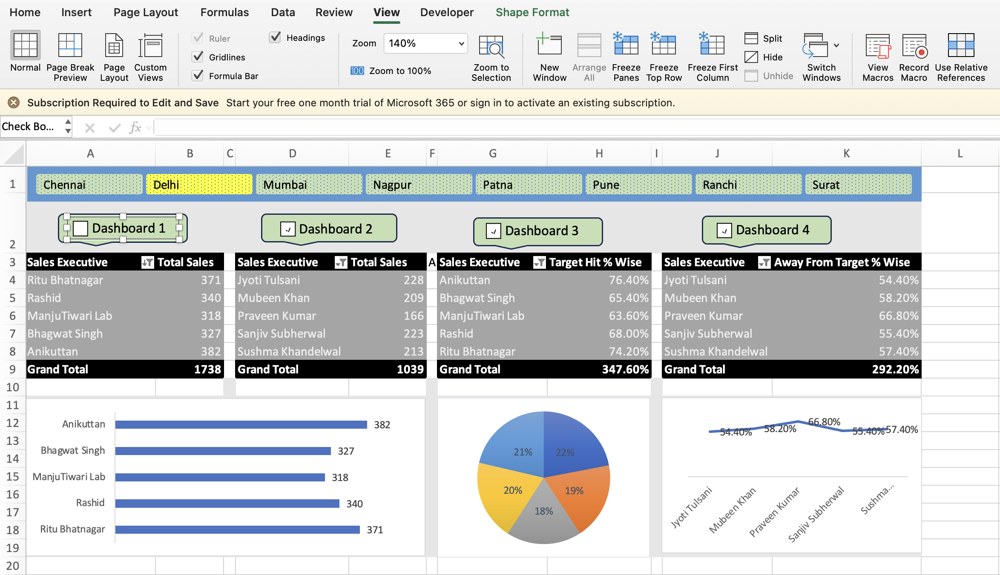

# Sales Performance Dashboard | Excel Project

## Project Overview
An interactive Excel dashboard project built using Pivot Tables, Pivot Charts, Slicers, VBA, and Macros to analyze sales performance from a large dataset.

The dashboard provides region-wise analysis of:
- Top 5 Sales Executives
- Bottom 5 Sales Executives
- Target Hit %
- Away From Target %
- Sales Performance Trends

## Features
- Dynamic Region-wise Dashboard
- Interactive Slicers
- Automated Dashboard Navigation using VBA & Macros
- Pivot Tables & Pivot Charts
- Pie Chart, Bar Chart & Line Chart Visualizations
- Clean and Professional Dashboard Design

## Tools & Skills Used
- Microsoft Excel
- Pivot Tables
- Pivot Charts
- VBA
- Macros
- Slicers
- Data Visualization
- Business Analytics

## Business Insights
This dashboard helps identify:
- High-performing sales executives
- Low-performing regions
- Target achievement trends
- Performance gaps across teams

## Project Screenshots

## Author
Sahil Sangram Mohanty
